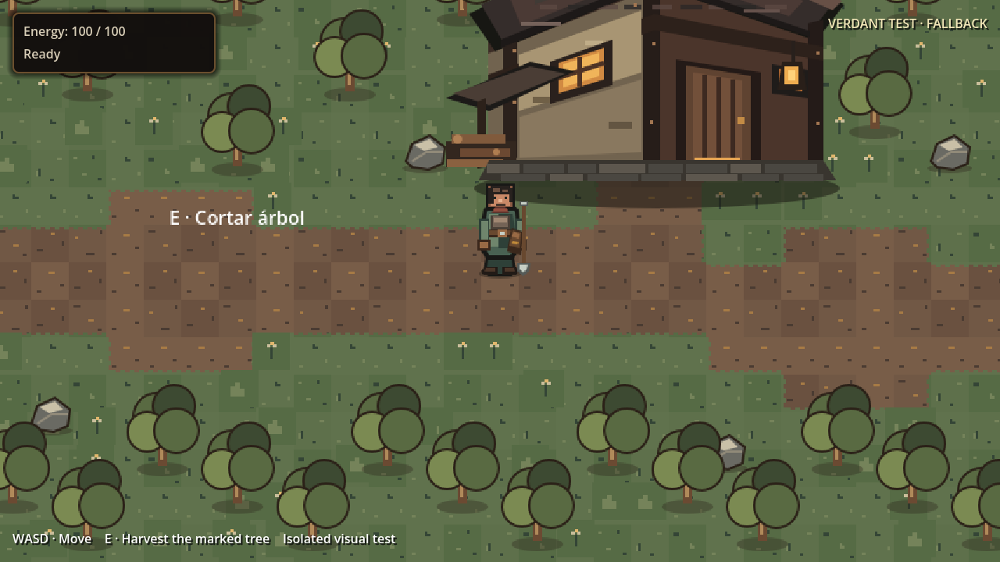

# Verdant 00 visual test

Open `verdant_test_map.tscn` and **Run Current Scene (F6)**, or from the project root:

```sh
godot --path . res://world/maps/verdant_test/verdant_test_map.tscn
```

This standalone 30×20 map reuses the real player, 1.5× camera, inventory,
energy, tree interaction and status HUD. **WASD** moves; **E** harvests the
marked tree. Trees, rocks, workshop and outer bounds have physical collisions.
The main scene, production maps, zone registry and save providers are unchanged.

## Local asset setup

Obtain [CSAF's Verdant 00 sample](https://csaf.itch.io/verdant-00-sample)
separately and read its `LICENSE.txt`. No third-party images are included here.
The entire `art/third_party/verdant_00/` directory is ignored by Git, including
Godot import sidecars. Do not force-add these files or the downloaded archive.

Use the pack's **loose PNGs**, with `tiles.json` to identify their roles.
Copy and rename them to the names below. These are this scene's local aliases,
not a claim about the publisher's filenames. No cropping or atlas reordering is
needed. Grouped sheets, proof renders and sample-map PNGs are not accepted.

All paths are relative to the project root:

| Role | Local destination | Native size | Required |
| --- | --- | --- | --- |
| First grass fill | `art/third_party/verdant_00/grass_0.png` | 16×16 | Enables local rendering |
| Other grass fills | `art/third_party/verdant_00/grass_1.png` through `grass_3.png` | 16×16 each | Optional |
| Dirt fills | `art/third_party/verdant_00/dirt_0.png` through `dirt_3.png` | 16×16 each | Recommended |
| Transparent tree | `art/third_party/verdant_00/tree.png` | 32×32 | Recommended |
| Transparent rock | `art/third_party/verdant_00/rock.png` | 16×16 | Recommended |
| Transparent bush | `art/third_party/verdant_00/bush.png` | 16×16 | Optional |
| Red flowers | `art/third_party/verdant_00/flowers.png` | 16×16 | Optional |

The exact minimum asset path is
`res://art/third_party/verdant_00/grass_0.png`.
The map's exported `asset_directory` can point to another local folder using
the same names. Raw PNG loading works without an editor import pass or `.import`
sidecars. Missing, invalid or incorrectly sized grass input selects the fallback.
Missing optional variants reuse variant zero, then repository art if necessary.
Missing optional props also use repository art; a partial setup is a mixed view.

## What to compare

- Uneven grass/dirt variation and a connected three-cell path with trimmed edges.
- Dense vegetation framing two clearings and the workshop approach.
- Prop silhouettes and player occlusion with Y-sort from ground contact points.
- The same layout, collision footprints, player and camera in both modes.

The title reports **LOCAL PNGs** or **FALLBACK**. To compare the same composition
with repository art, uncheck `use_local_assets` on the scene root and run F6.
Restore it for local rendering; keep such personal editor changes uncommitted.
Use normal F5 to compare with the production environment.

The sample's 16px art is displayed at **2× nearest** to preserve the game's 32px
logical cells; its 32px tree therefore displays at 64px. This is an explicit
scale experiment, not production art approval. The workshop remains repository
art because the sample has no building. This scene evaluates fills and props;
path edges are clipped from the dirt fills and do **not** exercise the pack's
complete 47-mask transition set. No external `.tres` or plugin is executed.

## Verification

```sh
godot --headless --path . --editor --quit
godot --headless --path . res://world/maps/verdant_test/verdant_test_map.tscn --quit-after 3
godot --headless --path . --script res://tests/run_tests.gd
```

`TestVerdantTestMap` runs through the existing bootstrap suite. It covers the
asset-free scene, real player movement/collisions/harvesting, raw PNG loading,
invalid inputs and the unchanged main-scene setting. Temporary PNG fixtures are
generated under `user://` and removed afterward; CI needs no licensed files.

Fallback capture: 1280×720, the real player camera at 1.5× zoom, default spawn,
`use_local_assets = false`, Godot 4.7.2. Reproduce the view with F6 at the project
window size. The preview directory is excluded from Godot imports.



Visual acceptance of the actual Verdant art requires the local pack. The
fallback and generated test fixtures are not evidence of that art's quality.
